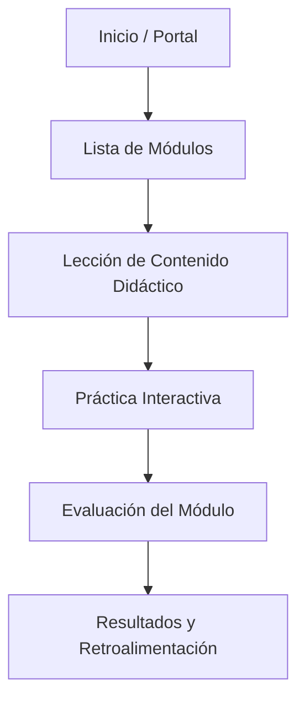
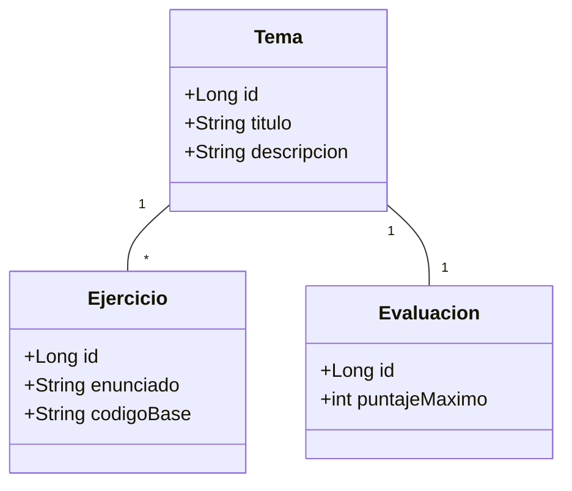

# Documentación de Diseño y Arquitectura — AulaLógica Web

## 1. Ficha del Problema y Usuario Objetivo
* **Título del Proyecto:** AulaLógica Web — Aplicativo Didáctico de Fundamentos de Programación en Java
* **Usuario Objetivo:** Estudiantes universitarios de primer semestre que inician en lógica de programación.
* **Problema:** Dificultad para visualizar la ejecución de algoritmos y comprender condicionales y ciclos en Java.
* **Solución:** Plataforma web local con Spring Boot que ofrece explicaciones, prácticas interactivas con retroalimentación inmediata y evaluaciones.

### Historia de Usuario Modelo
> *Como* estudiante que inicia en programación, *quiero* resolver un ejercicio de condicionales y recibir una explicación detallada del resultado, *para* comprender por qué se ejecutó una rama específica del programa.

### Matriz de Requisitos

| ID | Tipo | Descripción | Prioridad |
|---|---|---|---|
| **RF-01** | Funcional | Presentar contenidos teóricos y explicaciones didácticas sobre lógica y sintaxis de Java. | Alta |
| **RF-02** | Funcional | Permitir la resolución interactiva de ejercicios de condicionales y ciclos con retroalimentación inmediata. | Alta |
| **RF-03** | Funcional | Generar evaluaciones diagnósticas y calcular el puntaje obtenido por el estudiante. | Media |
| **RNF-01** | No Funcional | Desarrollado en Java usando Spring Boot y motor de plantillas Thymeleaf. | Alta |
| **RNF-02** | No Funcional | Arquitectura modular basada en el patrón MVC (Modelo-Vista-Controlador). | Alta |
| **RNF-03** | No Funcional | Interfaz ligera, clara y responsiva para ejecución en entorno local. | Media |

---

## 2. Arquitectura MVC por Capas
* **Vista (View - HTML5 + CSS3 + Thymeleaf):** Captura entradas del usuario en formularios y muestra el contenido didáctico y retroalimentación.
* **Controlador (Controller - `@Controller`):** Recibe las peticiones HTTP, gestiona rutas y delega la lógica a la capa de servicio.
* **Servicio (Service - `@Service`):** Contiene la lógica didáctica, realiza cálculos, aplica validaciones y determina puntajes.
* **Modelo (Model):** Representa las clases de datos (`Tema`, `Ejercicio`, `Pregunta`, `Resultado`) gestionadas en memoria.

---

## 3. Diagrama de Navegación y Flujo del Estudiante

## 4. Diagrama de Clases del Modelo (Spring Boot)

