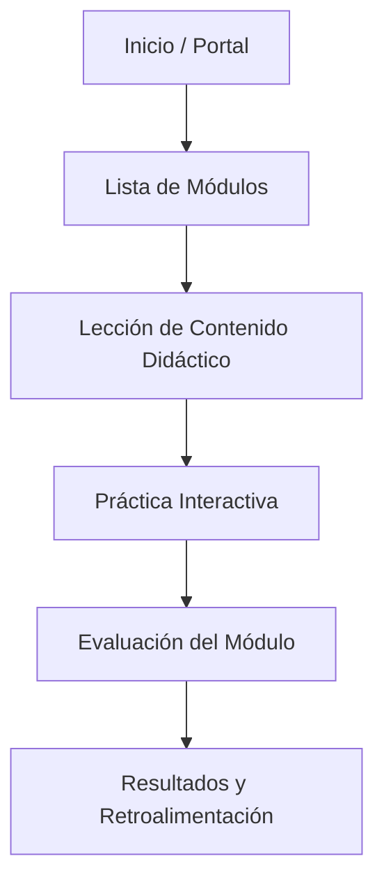
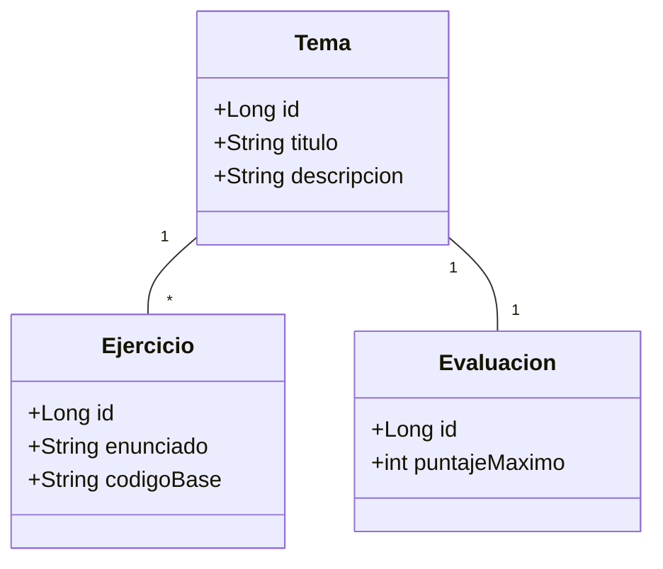

Documentación de Diseño y Arquitectura — AulaLógica Web

1. Ficha del Problema y Usuario Objetivo
Título del Proyecto: AulaLógica Web — Aplicativo Didáctico de Fundamentos de Programación en Java
Usuario Objetivo: Estudiantes universitarios de primer semestre que inician en lógica de programación.
Problema: Dificultad para visualizar la ejecución de algoritmos y comprender condicionales y ciclos en Java.
Solución: Plataforma web local con Spring Boot que ofrece explicaciones, prácticas interactivas con retroalimentación inmediata y evaluaciones.

Historia de Usuario Modelo
> Como un estudiante que inicia en programación, quiere resolver un ejercicio de condicionales y recibir una explicación detallada del resultado, para poder comprender por qué se ejecutó una rama específica del programa.

---

2. Arquitectura MVC por Capas
Vista (View - HTML5 + CSS3 + Thymeleaf): Captura entradas del usuario en formularios y muestra el contenido didáctico y retroalimentación.
Controlador (Controller - `@Controller`): Recibe las peticiones HTTP, gestiona rutas y delega la lógica a la capa de servicio.
Servicio (Service - `@Service`): Contiene la lógica didáctica, realiza cálculos, aplica validaciones y determina puntajes.
Modelo (Model): Representa las clases de datos (`Tema`, `Ejercicio`, `Pregunta`, `Resultado`) gestionadas en memoria.

---

3. Diagrama de Navegación y Flujo del Estudiante

4. Diagrama de Clases del Modelo (Spring Boot)

